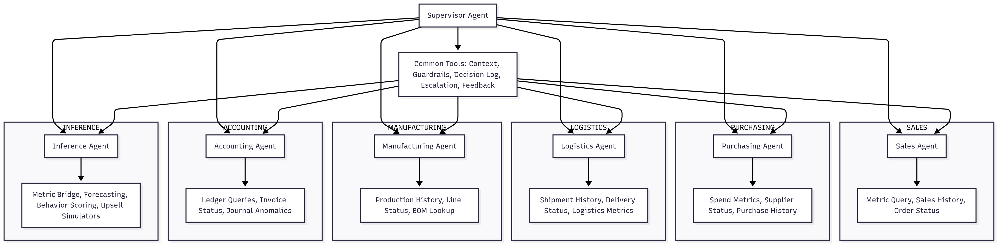

# Poseidon - Cedea's proprietary LLM with Agentic AI

## Purpose
The internal Large Language Model (LLM) for Cedea Seafood PT CitraDimensi Arthali, hereafter referred to as Poseidon, is designed to deliver actionable business insights from internal data, enhancing decision-making across sales, purchasing, logistics, manufacturing, and accounting. The LLM generates structured outputs for tasks such as upselling, customer segmentation, sales forecasting, and risk analysis, ensuring secure, on-premises processing to maintain data privacy and compliance.

## Components
To achieve its purpose, Poseidon includes the following key components:

- **LLaMA-3-8B-Instruct Model**: A fine-tuned, instruction-following LLM optimized for generating precise tool calls and business insights, running on a CPU-based Linux VM for on-premises deployment.
- **Synthetic Data Pipeline**: Generates domain-specific training data (`data/sft_data/sales_insights.jsonl`) for fine-tuning the LLM to handle tasks like upselling and forecasting.
- **Agent-Based Workflow**: Specialized agents (`poseidon-core/src/poseidon/agents/`) for sales, purchasing, logistics, manufacturing, accounting, and inference, orchestrated via a LangGraph workflow (`poseidon-core/src/poseidon/workflows/`) to process queries and execute tasks.
- **Tool Library**: Custom tools (`poseidon-core/src/poseidon/tools/`) for querying business data (e.g., customer purchases, order status) and inferring insights (e.g., upsell opportunities, payment risks). Shared utility tools provide guardrails, decision logging, and escalation hooks across agents.
- **Periodized Variance Marts**: dbt models (`poseidon-cda/dbt/analytics/cedea_metrics/models/periodized_metrics/`) that periodize commercial, supply, and production metrics, compute variances, and expose agent-ready views for "why" analysis.
- **RAG Document Index**: SOP embeddings pipeline (`poseidon-cda/scripts/embed_sops.py`) plus semantic retrieval tooling (`retrieve_similar_sop_documents`) so agents can cite standard operating procedures when guardrails trip.
- **Fine-Tuning Framework**: Scripts (`tuning/sft_tune.py`, `tuning/dpo_tune.py`) for supervised fine-tuning (SFT) and direct preference optimization (DPO) to adapt the model to Cedea's business needs.
- **Configuration System**: YAML files (`poseidon-core/config/`) for model, database, and logging settings, ensuring flexible and secure operation.
- **Evaluation Suite**: Tools (`evaluation/`) to validate model performance and ensure accurate insight generation.

## Project Structure
- `poseidon-core/src/poseidon/`: Core code for agents, tools, workflows, and utilities.
- `poseidon-core/tests/`: Shared unit, integration, and workflow tests.
- `poseidon-core/config/`: Configuration files for model and system settings.
- `poseidon-core/scripts/`: Operational scripts for core functionality.
- `poseidon-core/docs/`: Core documentation, diagrams, and milestone deliverables.
- `poseidon-core/src/poseidon/prefect/`: Prefect flow definitions, task libraries, deployments, and event router integrations for reporting, Lean telemetry, agent orchestration, and observability.
- `poseidon-cda/src/poseidon_cda/`: Customer-specific extensions and overrides.
- `poseidon-cda/scripts/`: Deployment and data utilities tailored to the CDA tenant.
- `poseidon-cda/data/`: Tenant data assets and templates.
- `poseidon-cda/dbt/`: Customer dbt project defining periodized marts and semantic metrics.
- `prefect-mcp/`: Scratch space and documentation for the Metric Context Protocol server integration.
- `backlog/`: Design docs, prompts, and research experiments.

## Operational Workflows

- **Prefect Orchestration** (`poseidon-core/src/poseidon/prefect/`): Use `poseidon prefect run ...` commands (see `poseidon-core/docs/howto/run_prefect_flows.md`) to run the replacement flows for the former Airflow DAGs. Prefect now orchestrates accounting & production mart refreshes (with optional SharePoint exports), the Lean ingestion pipeline that hydrates the unified event log, the dbt semantic layer build, Langfuse trace cycles, LangChain agent batches, continuous observability sweeps, MCP metadata exports, and weekly Hansei reports; legacy ClickHouse flows remain in the CLI for archival reference but execute as no-ops because the ADW now runs fully on Postgres.

- **Variance Refresh**: Run `dbt build --select periodized_metrics` inside `poseidon-cda/dbt/analytics/cedea_metrics` to materialize the date spine, weekly periodized facts, and the `root_cause_variances` view consumed by `root_cause_tool`.
- **SOP Embeddings**: Execute `python poseidon-cda/scripts/embed_sops.py --limit 20` (optional limit) after exporting valid Microsoft Graph credentials. The script downloads SOP documents, generates OpenAI embeddings, and upserts them into the `analytics_semantic.sop_embeddings` pgvector table.
- **Semantic Retrieval**: Enable the document tools via `poseidon-core/config/feature_flags.yaml` to allow agents to call `retrieve_similar_sop_documents` and surface relevant SOP excerpts in responses.

## Environment Variables

| Variable | Purpose |
|----------|---------|
| `POSEIDON_POSTGRES_HOST`, `POSEIDON_POSTGRES_PORT`, `POSEIDON_POSTGRES_DATABASE`, `POSEIDON_POSTGRES_USER`, `POSEIDON_POSTGRES_PASSWORD` | Primary warehouse connection used by dbt, Prefect flows, and the LangChain tools. |
| `POSEIDON_REPLICA_HOST`, `POSEIDON_REPLICA_PORT`, `POSEIDON_REPLICA_DATABASE`, `POSEIDON_REPLICA_USER`, `POSEIDON_REPLICA_PASSWORD` | Optional replica / FDW connection consumed by reporting flows when present. |
| `POSEIDON_PREFECT_SALES_MV`, `POSEIDON_PREFECT_ACCOUNTING_MV`, `POSEIDON_PREFECT_PRODUCTION_MV` | Override paths for materialized-view manifests used by the reporting flows. |
| `LANGFUSE_HOST`, `LANGFUSE_PROJECT_ID`, `LANGFUSE_PUBLIC_KEY`, `LANGFUSE_SECRET_KEY` | Langfuse connection details and API credentials for trace logging and prompt retrieval. |
| `MLFLOW_TRACKING_URI`, `POSEIDON_MLFLOW_EXPERIMENT` | MLflow tracking location and default experiment name for experiment flows. |
| `FASTAPI_LOG_EXPORT_URL`, `OBSERVABILITY_EVENT_URL` | Endpoints scraped by the ingestion flow for FastAPI request logs and observability anomalies. |
| `POSEIDON_LEAN_SCHEMA` | Schema housing Lean telemetry marts (`cedea_metrics` by default). |
| `TEAMS_WEBHOOK_URL` | Microsoft Teams webhook used by the Andon and Hansei flows. |
| `POSEIDON_AUTH_TOKEN`, `POSEIDON_LOGIN_USERNAME`, `POSEIDON_LOGIN_PASSWORD` | Authentication tokens leveraged by the API and Agent Chat UI. |
| `POSEIDON_DISABLE_AGENTS`, `POSEIDON_DISABLE_DB`, `POSEIDON_DISABLE_LLM` | Test toggles used during smoke/unit runs to bypass heavy dependencies. |
| `POSEIDON_ENVIRONMENT`, `POSEIDON_ENABLE_DOCS`, `POSEIDON_ENABLE_EMAIL`, `POSEIDON_TRACE_STREAM` | Feature toggles resolved by `feature_flags.yaml`. |
- **Async Workflow Dispatch**: Queue long-running orchestrations with `POST /workflows/run_async` (returns a `task_id`) and poll `GET /workflows/results/{task_id}` for status/results. The in-process dispatcher shares the same supervisor logic and typed contracts defined in `src/contracts/agent.py`.
- **Observability Telemetry**: Apply `docs/schema/observability_events.sql` to create the Postgres tables that store user actions, agent executions, and application events emitted from the FastAPI workflow routes.

## Testing & Development

- Run targeted smoke tests with `POSEIDON_DISABLE_AGENTS=1 POSEIDON_DISABLE_DB=1 POSEIDON_DISABLE_LLM=1 PYTHONPATH=poseidon-core/src:poseidon-cda/src pytest poseidon-core/tests/...`. These environment toggles short-circuit heavy dependencies (database, local LLM, LangChain agents) so unit tests can execute inside constrained sandboxes.
- Check `poseidon-core/tests/TEST_RUN_ORDER.md` for a step-by-step sequence covering unit, integration, and workflow suites.
- The disable flags are intended for automated tests and local development only. Runtime services (FastAPI surfaces, CLI, pipelines) should rely on the real implementations until we replace these toggles with a formal dependency-injection pattern.
- CI scripts should explicitly set the toggles they depend on to avoid drifting behaviour between environments.

### Required Environment Variables

Set the following secrets before running the workflows above:

- `DB_PASSWORD` – Postgres credential referenced by `poseidon-core/config/db_config.yaml` (the YAML file now stores only `password_env_var`). Place this in your shell export or `.env` file.
- `OPENAI_API_KEY` – Used for embeddings and local LLM fallbacks.
- `SOP_EMBED_MODEL` (optional) – Override the embedding model (`text-embedding-3-large` by default).
- `SOP_EMBED_TABLE` (optional) – Target table for SOP embeddings (defaults to `analytics_semantic.sop_embeddings`).
- `POSEIDON_AUTH_TOKEN`, `POSEIDON_LOGIN_USERNAME`, `POSEIDON_LOGIN_PASSWORD` – Shared bearer auth used by the LangGraph deployment, `/login` endpoint, and Agent Chat UI proxy. Generate unique values per environment.

## Model Flowchart

> **Notes:**  
> - Supervisor Agent routes queries to specialized agents.  
> - Each agent has its own toolset for querying data and generating insights.  
